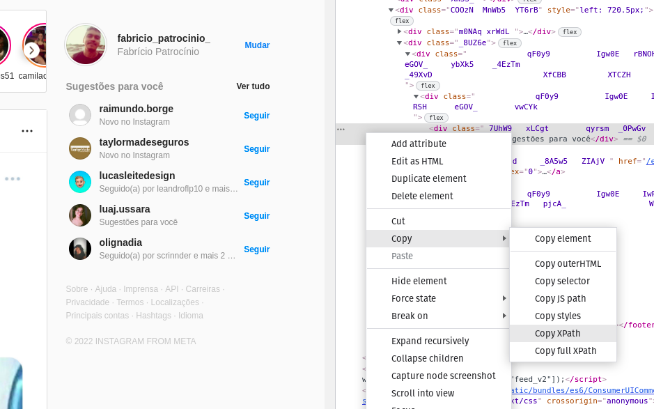

# Automation to engage instagram account
Automation has the following features:

- [x] Followed people suggested by IG.
- [x] Unfollowed people suggested by IG.
- [x] Clear direct messages.

## Create and configure the file `.env` with:
- **EMAIL=example@hotmail.com** - Your email or username.
- **PASSWORD=123** -Your password.
- **FALLOW_PEOPLE=50** - Number of people to follow. Remember that you can only follow 200 people per day.
- **UNFALLOW_PEOPLE=30** - Number of people to unfollow.
- **DELETE_MESSAGE=1** - Number of messages you want to delete.

## First install all dependencies
Inside the root folder `/robot_for_ig_followers`:
```
poetry install
```
```
poetry shell
```
And install playwright:
```
playwright install
```

## Run
To run it is very simple in the root folder `/robot_for_ig_followers` run the following commands.

**To follow people suggested by IG:**
```
python3 main.py follow
```
**To unfollow people:**
```
python3 main.py unfollow
```
**To clear messages from Direct:**
```
python3 main.py cleardirect
```
**To see the automation happen in the browser use, example:**
```
python3 main.py follow --browser on
```

## Important!
Because it is automation, errors can occur in the way of interactions, since the frontend of Intagram, like any other site, is constantly updated, but it is a simple thing to do.

Right click on **inspect**, press **Ctrl + Shift + C** and place it over the place where the automation is trying to click or interact.

Once this is done, right-click on the desired HTML element and copy the **XPath** or full **XPath** if the value in the automation starts with **//html**, example: `fallowers = f'// html/body/div[1]/section/main/div/div[2]/div/div/div[{number}]/div[3]/button'` otherwise anyone starting with `//*[@id="react-root"]` is **XPath**.
<p align="center">
  
</p>
